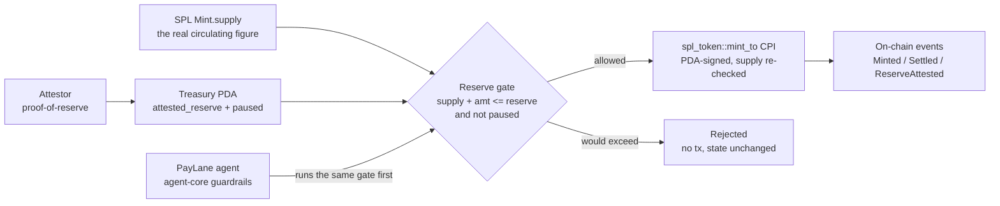
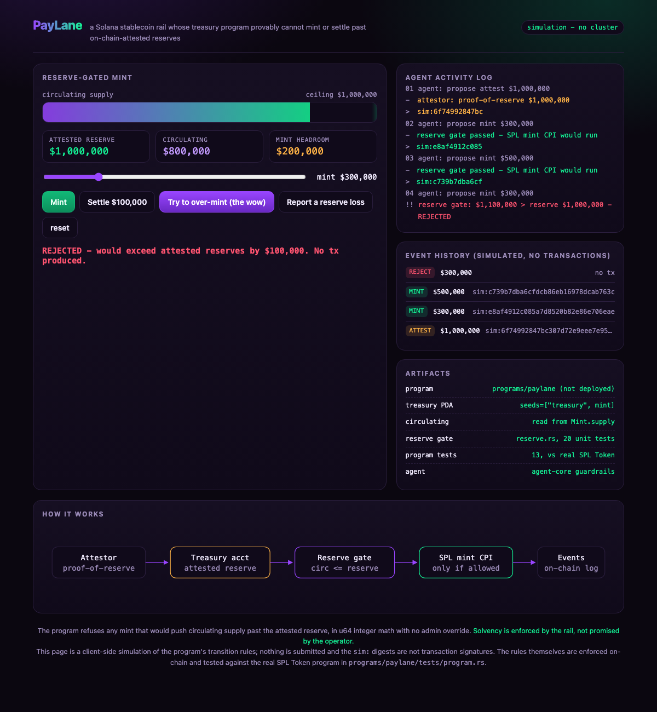

# PayLane

A Solana payment rail whose treasury program **provably cannot mint or settle past
on-chain-attested reserves**. Ask for one unit more than the reserves back, and the
program refuses. No admin can override it.

Fiat-backed stablecoins settle on-chain but enforce solvency off-chain: the issuer
holds reserves at a bank and promises circulating supply never exceeds them. PayLane
moves that promise into the program. The treasury is an [Anchor](https://www.anchor-lang.com/)
account bound to one [SPL Token](https://spl.solana.com/) mint; it stores the reserves
attested on-chain and a pause flag, and it does **not** store circulating supply.
Circulating is read from the bound `Mint.supply` on every instruction, so the ledger
cannot drift from the tokens that actually exist.

**Milestone 1** of the PayLane grant proposal: the reserve-gate program plus the
attestation path, enforced by a CPI into the real SPL Token program and tested against
it. Solana devnet target only, never mainnet.

**[▶ Live demo](https://doom2quake.github.io/paylane/ui/)**  ·  **[Watch the walkthrough](https://youtu.be/IvzUJA82QnI)**  ·  **[Paper (PDF)](paper/paper.pdf)**  ·  **[Deck (PDF)](deck/deck.pdf)**  ·  Built on **[Solana](https://solana.com/)**

Read [What is actually verified, and what is not](#what-is-actually-verified-and-what-is-not)
first for the short version of what is proved, what is simulated, and what is not built.
Nothing on this page contradicts it.

## The three rules the program enforces

1. **A mint cannot exceed attested reserves.** `Mint.supply + amount <= attested_reserve`,
   in checked u64 math, with no bypass instruction. On success the program does a real
   `spl_token::mint_to` CPI signed by the treasury PDA, then re-reads the mint and asserts
   the supply moved by exactly `amount`.
2. **Redemption burns.** `settle` burns the holder's tokens, and the holder signs. There is
   no instruction that lowers circulating supply without destroying tokens, so settlement
   cannot manufacture unbacked headroom.
3. **A reserve loss is recorded, not refused.** An attestation below circulating supply is
   the truth about a shortfall. It is written on-chain and pauses the treasury; every mint
   is then refused until an attestation covers supply again or holders redeem back under the
   line.

## The hero, in one run

```
$ paylane demo
1. Attestor posts proof-of-reserve on-chain: $1,000,000 backing
2. Mint $300k, then $500k -> allowed (circulating $800k)
3. Mint $300k more -> $1.1M vs $1.0M backing -> REJECTED, no tx, state unchanged
4. Settle $100k (a burn) -> frees mint headroom
5. The same $300k mint now fits under the ceiling -> allowed
6. Reserves audited down to $600k -> RECORDED, treasury PAUSES
7. Any mint while undercollateralized -> refused, however small
8. Holders redeem $400k -> solvency restored, treasury unpauses
```

Step 6 is the one worth pausing on. The naive move is to reject an attestation that comes
in below circulating supply, because it violates the invariant, and keep the last "good"
figure. That leaves a stale, too-high reserve on the books and hides the shortfall. PayLane
does the opposite: it records the loss as the truth and pauses minting until supply is
covered again. The same guarantees are enforced on-chain, and `cargo test` proves each of them.

## What is actually verified, and what is not

This matters more than any claim above, so it is near the top.

**Verified here, by `cargo test`:** the program's instructions run against the **real SPL
Token program** inside `solana-program-test`, an in-process bank whose genesis contains the
actual SPL Token binary. `programs/paylane/tests/program.rs` asserts on the SPL `Mint`
account and on token-account balances, not on anything PayLane wrote about itself: mint
authority really moves to the treasury PDA, a successful mint really moves `Mint.supply`, a
rejected one moves nothing, `settle` really burns, and a recorded reserve loss really blocks
the next mint. A stubbed-out mint helper fails all thirteen of those tests.

**Not verified here:** the program is **not deployed**. `anchor build` / `cargo build-sbf`
need the Solana toolchain, which is not installed in this environment, so there is no devnet
program id, no funded keypair, and no explorer-verifiable transaction. `Anchor.toml` is
present and the crate is a standard Anchor workspace member, so `anchor build` is the only
missing step, but we have not run it and do not claim to have.

**There is no live submission client.** The Python agent drives an offline mirror of the
treasury, and it says so: its events are labelled `simulated` and carry a `sim:` digest,
never a fake signature. If the live environment variables are set and no client is injected,
`Treasury` **refuses to construct** instead of quietly running the simulation and calling it
devnet. What `paylane/chain.py` does ship, and does test, is the wire format a live client
needs: the Anchor instruction discriminators and the exact `Treasury` account layout.

| Component | Command | Status |
|---|---|---|
| Reserve invariant (`reserve.rs`, both crates) | `cargo test` | 39 / 39 passing, here |
| Program vs. real SPL Token (`tests/program.rs`) | `cargo test` | 13 / 13 passing, here |
| Python agent, seam, wire format, CLI | `pytest` | 44 / 44 passing, here |
| Deployable SBF artifact | `anchor build` | not run; Solana toolchain absent |
| Devnet deployment / explorer links | `anchor deploy` | none; nothing is deployed |

## Why it wins

- **Solana / Anchor is load-bearing.** The guarantee is enforced by the on-chain program
  (`programs/paylane`), not by the UI or the agent. Remove the program and there is no gate.
- **The claim is tested against the real thing.** The gate is tested as pure Rust, and the
  instructions around it are tested against the real SPL Token program with real CPIs, real
  supply changes and real burns.
- **Visceral, one-action demo.** Push the mint slider past the reserve ceiling, or click
  "Report a reserve loss", and watch the program refuse.
- **A real, under-served use case.** Fiat-backed stablecoin solvency is enforced off-chain
  everywhere today. This makes it a program invariant.

## Architecture



## Quickstart (keyless)

```bash
pip install -e .
paylane demo                       # the whole hero story, offline
paylane attest 1000000000000       # attest reserves (base units)
paylane mint 400000000000          # mint (reserve-gated)
paylane state                      # reserves, circulating, headroom, pause
paylane reset                      # start over

cargo test                         # 52 Rust tests: reserve invariant + program vs real SPL Token
PYTHONPATH=. python -m pytest -q   # agent, seam, wire format, CLI: 44
```

CLI commands share one treasury via `.paylane-state.json` (override with `--state PATH`), so
`attest`, then `mint`, then `state` form a real workflow.

The agent runs **keyless by default** and keeps its audit journal in-process. Nothing is
written to a cloud project unless you set `PAYLANE_IN_MEMORY_STATE=0` yourself.

## What's inside

| Piece | File |
|---|---|
| On-chain treasury program | `programs/paylane/src/lib.rs` |
| Reserve invariant (one source of truth) | `programs/paylane/src/reserve.rs` |
| Program tests vs. real SPL Token | `programs/paylane/tests/program.rs` |
| Toolchain-free test harness | `reserve-core/` (`cargo test`) |
| Reserve gate, Python port | `paylane/ledger.py` |
| Treasury adapter seam (offline mirror, fail-closed live) | `paylane/treasury.py` |
| Anchor wire format (discriminators, account layout) | `paylane/chain.py` |
| Agent (guardrails + audit log) | `paylane/agent.py` |
| CLI with `demo` | `paylane/main.py` |
| UI (self-contained, offline) | `ui/index.html` |

## Built on Solana

PayLane is a candidate entry to the [Solana Foundation Grants](https://solana.org/grants)
programme, applied for through the regional route that [Superteam](https://superteam.fun/)
runs for the [Solana](https://solana.com/) ecosystem. It is an application, **not** an
accepted, funded, or endorsed grant: there is no partnership with the Solana Foundation or
Superteam and no endorsement, and nothing here should be read as one.

The reason it belongs on Solana rather than a general-purpose chain is that the guarantee is
built out of two Solana primitives that do not exist elsewhere in this form:

- **`Mint.supply` is read, never stored.** The authoritative circulating figure lives in the
  [SPL Token program](https://spl.solana.com/), and PayLane reads it on every instruction
  instead of keeping its own copy. The reserve check is always measured against the tokens
  that actually exist. Remove this and you are back to a self-reported ledger that can drift.
- **Mint authority is a PDA, not a person.** At initialization the mint authority is handed to
  the treasury program-derived address, so the only path that can mint is the program's own
  gate, enforced through a real `mint_to` CPI. There is no admin key to mint around it.

That is the "only possible on Solana" shape the Foundation looks for: a reserve invariant
enforced by [Anchor](https://www.anchor-lang.com/) and a CPI into the real token program,
with authority owned by a PDA. The milestone roadmap turns the tested-here program into a
deployed devnet program with an SDK and a hosted demo. Everything in this repo is Solana
**devnet/testnet only**, with no mainnet deployment and no real funds.

The full milestone-mapped write-up is in [docs/PROPOSAL.md](docs/PROPOSAL.md).

## Paper, deck & UI

- **[Paper (PDF)](paper/paper.pdf):** `paper/paper.tex` with a verifiable `references.bib`, a
  short technical write-up (rebuild: `tectonic paper/paper.tex`).
- **[Deck (PDF)](deck/deck.pdf):** `deck/deck.md`, a Marp slide deck (rebuild: `marp deck/deck.md --pdf`).
- **[Live demo](https://doom2quake.github.io/paylane/ui/):** `ui/index.html`, the interactive
  reserve-gauge demo (also opens offline over `file://`). It is a browser simulation and says
  so on the page; it shows the program's real instruction shapes and reserve gate, and no
  invented transaction signatures.
- **Walkthrough video:** [`docs/paylane-demo.mp4`](docs/paylane-demo.mp4), a narrated tour of
  the invariant, the reserve-loss pause, the architecture, and the grant roadmap (also on
  [YouTube](https://youtu.be/IvzUJA82QnI)).
- **Demo script:** `DEMO.md`, the recording kit.

[](https://doom2quake.github.io/paylane/ui/)

## Citation

```bibtex
@software{sarkar_paylane_2026,
  author  = {Dipankar Sarkar},
  title   = {PayLane: A Reserve-Gated Stablecoin Treasury on Solana},
  year    = {2026},
  url     = {https://github.com/doom2quake/paylane}
}
```

## License

MIT - see [LICENSE](LICENSE). Testnet/devnet only; no mainnet or real funds.
